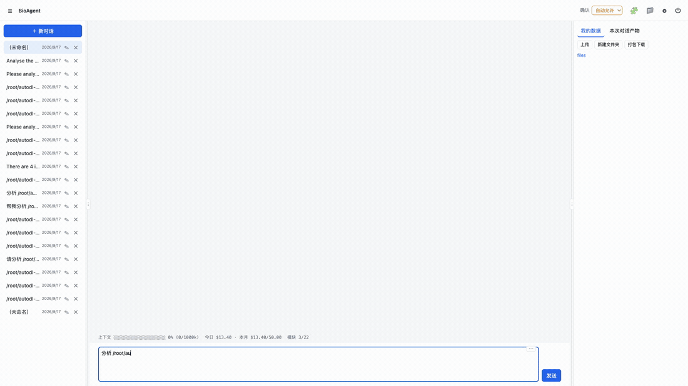
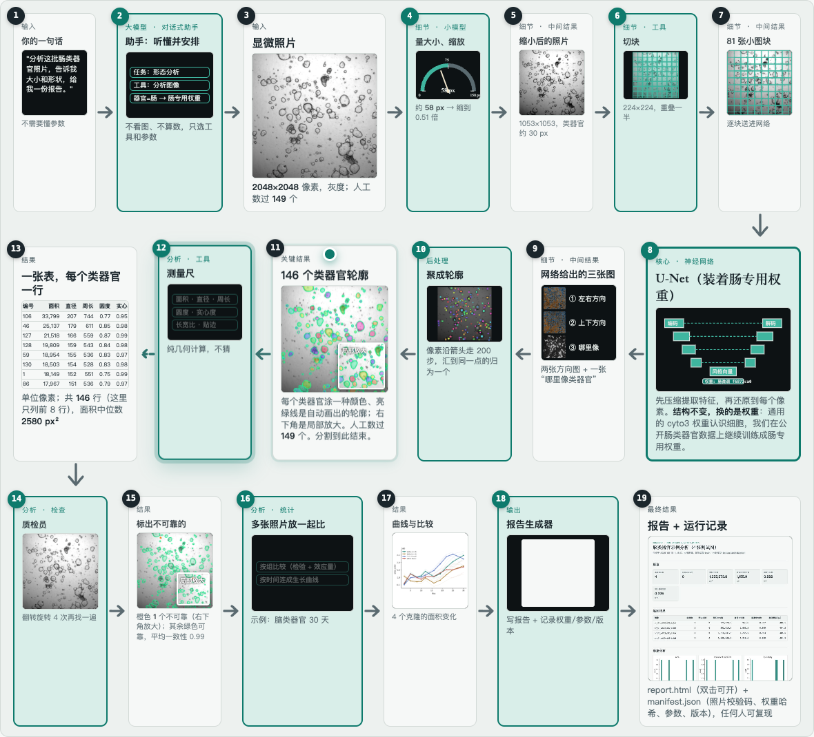
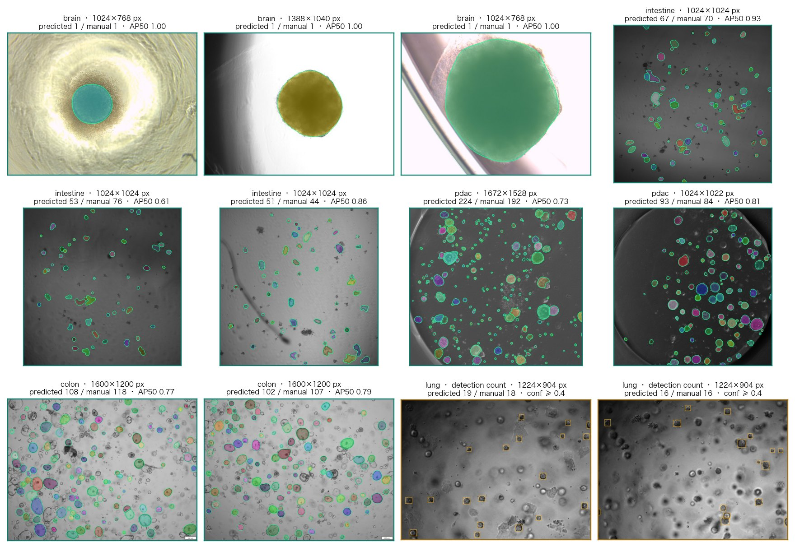

<div align="center">

# Orgalyst

**A conversational analysis system for organoid bright-field images**

*One sentence in, a reproducible report out — every number computed by a deterministic toolkit, explained by an assistant that knows the protocol.*

[](LICENSE)
[](requirements.txt)
[](https://huggingface.co/XiaoyanLi/orgalyst-weights)
[](https://huggingface.co/XiaoyanLi/orgalyst-weights/resolve/main/demo/orgalyst_demo_en.mp4)
[](docs/technical_report_en.pdf)
[](https://zenodo.org/records/16355179)

AI4S Open Innovation: AI for Life Science · 5th Pazhou Algorithm Competition · AI + Organ-on-a-Chip
**Category: End-to-End System** · Team **Orgalyst Lab**



</div>

---

## Why

Organoid and organ-on-a-chip experiments produce bright-field micrographs every day, and the questions are always the same: *how many, how big, has anything changed*. The algorithms exist — Cellpose, OrganoID, OrgaSegment segment organoids well — but a bench scientist still needs to install an environment, pick a model, tune a diameter parameter, then reinvent the measuring, statistics and reporting, and three months later nobody can say which model produced a given number.

Orgalyst closes that gap with two layers:

| Layer | What it is | What it guarantees |
|---|---|---|
| **`orgalyst` toolkit** | A plain Python package and CLI. Organ-specific Cellpose segmentation, YOLO counting with calibrated thresholds, morphometry, two-level QC, group statistics, growth curves, a single-file HTML report and a provenance manifest. | Needs **no language model**. Every run records input hashes, weight hashes, parameters and versions, so every number can be recomputed. |
| **Conversational assistant** | A Claude Agent SDK assistant that reaches the toolkit through six MCP tools and follows a written analysis protocol (a *skill*). Terminal and multi-user web editions. | Understands the request, picks the organ weights, checks the results, reports in a fixed format — and **never computes a number itself**. |

Everything was developed and evaluated on the public **OrgLine** dataset (eight sources, five organs, CC-BY-4.0). No private data, no extra annotation.

## What it does

<table>
<tr><td width="50%"></td>
<td>

**The journey of one image.** From the user's sentence to tool selection, size estimation, rescaling, tiling, a U-Net loaded with intestine-specific weights, flow and probability maps, tracking into 146 contours, then measurement, QC, statistics, and finally the report with its run record. The interactive version is [`docs/orgalyst_scene.html`](docs/orgalyst_scene.html).

**Ask in plain language:**
- *"How many organoids are in these images?"* → detector count per image
- *"Analyse these intestinal organoids, size and shape"* → segmentation, morphometry, report
- *"Pixel size is 3.16 µm"* → results in micrometres (never estimated when unknown)
- *"Which segmentations are unreliable?"* → flip/rotate agreement flags
- *"Is there a difference between control and treated?"* → Mann-Whitney, Cliff's delta, box plot
- *"How much did it grow from day 2 to day 30?"* → growth curves per individual
- *"Which model and parameters? How do I reproduce this?"* → the manifest

</td></tr>
</table>

<details>
<summary><b>Toolkit capabilities in detail</b></summary>

- **Segmentation** — Cellpose 3 with **organ-specific weights** (cyto3 fine-tuned separately on brain, intestine, pancreatic cancer, colon) and a **per-organ diameter strategy** (`model` / `sizemodel` / two-pass `refine`), which fixes the scale failure that makes generalist Cellpose miss 400-px brain organoids entirely. Unknown organs fall back to the generalist model with an explicit low-accuracy notice.
- **Counting** — one YOLO11m detector trained jointly on three organs; confidence thresholds calibrated per organ on the validation set (0.50 / 0.45 / 0.40) instead of the mAP-oriented default 0.25.
- **Morphometry** — area, equivalent diameter, perimeter, circularity, solidity, aspect ratio, border flag; micrometre columns when a pixel size is given; border-touching instances excluded from summaries by default and counted.
- **Quality control** — image-level sharpness / illumination / saturation; instance-level test-time-augmentation agreement (4 dihedral transforms) that flags unstable segmentations in orange.
- **Statistics & growth** — Mann-Whitney / Kruskal-Wallis with Cliff's delta and Holm correction; growth curves over individuals, time points and groups with fold change.
- **Provenance** — `manifest.json` with md5 of every input, model identifier and weight hash, all parameters, library versions, GPU and a step log; single-file `report.html` that opens with a double click.
- **Assistant** — six MCP tools (`list_models`, `analyze_images`, `count_organoids`, `compare_groups`, `growth_curves`, `run_summary`), an `organoid-analysis` skill encoding the protocol (confirm organ / pixel size / goal → choose tools → verify → fixed report format; no micrometres without calibration, no recomputation in Python), a permission gatekeeper, per-account memory, spending limits, and an `ANTHROPIC_BASE_URL` path to open-model gateways.

</details>

## Try it live

A judge account is open on our web instance: **https://u598784-yymh-c3389f55.weste.seetacloud.com:8443/** — account `judge`, password `orgalyst-judge-2026`. Sample images are on the server under `/root/autodl-fs/AI4S/e5/data/` (say, for example, *"analyse the 4 intestinal organoid images under /root/autodl-fs/AI4S/e5/data/intestine and generate a report"*), or upload your own bright-field images from the right-hand panel. The instance is a single cloud GPU and may be offline outside the review period; the [demo video](https://huggingface.co/XiaoyanLi/orgalyst-weights/resolve/main/demo/orgalyst_demo.mp4) ([English narration](https://huggingface.co/XiaoyanLi/orgalyst-weights/resolve/main/demo/orgalyst_demo_en.mp4)) and Appendix A of the technical report are the fallback.

## Quick start

```bash
git clone https://github.com/xiaoyanLi629/orgalyst && cd orgalyst
python -m venv .venv && source .venv/bin/activate
pip install -r requirements.txt          # install torch for your CUDA version first if needed (see scripts/setup_env.sh)
bash scripts/download_weights.sh         # ~200 MB from Hugging Face; add --mirror in mainland China
export CELLPOSE_LOCAL_MODELS_PATH=$PWD/weights/cellpose ORGALYST_ROOT=$PWD

# 1) segmentation + morphometry + report for any folder of bright-field images
python -m orgalyst analyze --organ intestine --images /path/to/images --out runs --name demo
#    → runs/demo_<id>/{report.html, manifest.json, tables/features.csv, tables/summary.json, masks/, overlays/}

# 2) counting only (detector, calibrated threshold)
python -m orgalyst count --organ lung --images /path/to/images --out runs

# 3) physical units, QC and growth curves
python -m orgalyst analyze --organ brain --images DIR --pixel-size 3.1646 --qc --meta meta.csv --out runs --name growth
python -m orgalyst track --run runs/growth_<id> --meta meta.csv
```

Organs: `brain` `intestine` `pdac` `colon` for segmentation, `intestine` `brain` `lung` for detection, `generic` when unknown.
Docker: `docker build -t orgalyst . && docker run --gpus all -v /path/to/images:/data -v $PWD/runs:/runs -v $PWD/weights:/app/weights orgalyst analyze --organ intestine --images /data --out /runs`

<details>
<summary><b>Run the assistant</b></summary>

```bash
cd agent && bash install.sh                         # .venv with claude-agent-sdk, fastapi …
cp config.example.yaml config.yaml                   # mcp_servers already points at ../orgalyst/mcp_server.py
mkdir -p ~/.config/bioagent && printf 'ANTHROPIC_API_KEY=sk-ant-...\n' > ~/.config/bioagent/.env && chmod 600 ~/.config/bioagent/.env
./bioagent.sh --user demo                            # terminal edition; type /auto auto to skip per-call confirmation
bash scripts/bioagent-web.sh                         # web edition (multi-account)
```

See [`agent/README.md`](agent/README.md) for the permission model, the skill and the open-model gateway path.

</details>

## Results

All numbers are on OrgLine test sets and reproduce from the scripts below; every table in the technical report maps to a file in [`results/`](results/).

<table>
<tr><td>

**Segmentation, instance AP50**

| Organ (test images) | cyto3 zero-shot | Fine-tuned + diameter strategy |
|---|---:|---:|
| brain (240) | 0.005 | **0.967** |
| intestine (12) | 0.544 | **0.812** |
| colon (10) | 0.405 | **0.815** |
| pdac (20) | 0.419 | **0.591** |

</td><td>

**Counting by detection, joint YOLO11m**

| Organ | mAP50 | Count MAPE 0.25 → calibrated |
|---|---:|---:|
| intestine | 0.948 | 0.262 → 0.207 |
| brain | 0.995 | 0.018 → 0.004 |
| lung | 0.936 | 0.235 → 0.168 |

</td></tr>
</table>

- **Agreement with expert annotation** (brain, 240 images): Spearman 0.963, median relative error 1.9 %, 93 % of images within 10 %.
- **Cross-organ generalisation is limited** (0.15–0.47 AP50 on unseen organs), which is why weights are organ-specific; fine-tuned **Cellpose-SAM** matches but does not beat fine-tuned cyto3 at 50× the weight size, so it is kept only as a comparison.
- **QC flags are informative but not exhaustive**: flagged instances are 3.5–6.8× more likely to be wrong, recall 0.07–0.13 — a hint, not a filter.
- **End-to-end agent benchmark**: 12 natural-language tasks judged automatically against command-line reference values — **12 / 12 passed**, 99 s and 9.9 tool calls per task on average (Claude backend, full re-run after the analysis skill and the code guard were added; the first run also passed 12 / 12).

<p align="center"></p>

<details>
<summary><b>Reproduce every table</b></summary>

```bash
bash scripts/download_orgline.sh && bash scripts/extract_orgline.sh   # OrgLine raw data (~25 GB)
python scripts/prepare_data.py                                          # → data/processed (8-bit PNG, uint16 masks, YOLO labels)
bash scripts/run_e1_zeroshot.sh; bash scripts/run_e1_finetune.sh        # E1 zero-shot / per-organ fine-tuning
bash scripts/run_e1_crossorgan2.sh                                      # E1 joint and leave-one-organ-out
bash scripts/run_e2_det.sh; python scripts/calibrate_det_conf.py        # E2 detection + threshold calibration
python scripts/e3_consistency.py                                        # E3 agreement with expert areas
python scripts/e4_qc_eval.py; python scripts/bench_timing.py            # E4 QC evaluation, timing
bash scripts/run_cpsam_ft.sh                                            # Cellpose-SAM comparison (separate env: scripts/setup_cellpose4.sh)
bash scripts/e5_prepare.sh; python scripts/run_agent_tasks.py           # E5 agent benchmark (needs agent/ and an API key)
```

Expected wall time on one RTX 5090 D: data preparation 15 min, E1 fine-tuning 2.5 h, cross-organ 3 h, E2 4.5 h, E3 10 min, E5 25 min (≈ 6 USD of API usage).

</details>

## Repository layout

```
orgalyst/     toolkit — config (model registry, calibrated thresholds) · segment · detect · morphometry · qc · compare · track · overlay · run · report · cli · mcp_server
scripts/      data preparation, experiments E1–E5, weight/data download, figure and document builders
results/      every experiment result (json / csv) referenced by the report
docs/         technical report (EN / 中文, HTML + PDF) · Kaggle writeup · design document · interactive pipeline animation · assets
agent/        the assistant (Claude Agent SDK + MCP + permission gatekeeper + web UI) with the organoid-analysis skill; no accounts or secrets
e5/           reference values for the agent benchmark (data drawn from OrgLine by scripts/e5_prepare.sh)
weights/      not in git — scripts/download_weights.sh
```

## Documents

| | English | 中文 |
|---|---|---|
| Technical report (20 pages + appendix) | [HTML](docs/technical_report_en.html) · [PDF](docs/technical_report_en.pdf) | [HTML](docs/technical_report.html) · [PDF](docs/technical_report.pdf) |
| Kaggle writeup | [HTML](docs/kaggle_writeup_en.html) · [PDF](docs/kaggle_writeup_en.pdf) · [Markdown](docs/kaggle_writeup_en.md) | [HTML](docs/kaggle_writeup_zh.html) · [PDF](docs/kaggle_writeup_zh.pdf) · [Markdown](docs/kaggle_writeup_zh.md) |
| Design document | — | [HTML](docs/design.html) |
| Interactive pipeline animation | — | [HTML](docs/orgalyst_scene.html) |
| Demo video (bilingual captions) | [English narration, 3:17](https://huggingface.co/XiaoyanLi/orgalyst-weights/resolve/main/demo/orgalyst_demo_en.mp4) | [中文配音，3:43](https://huggingface.co/XiaoyanLi/orgalyst-weights/resolve/main/demo/orgalyst_demo.mp4) |

## Limitations, stated plainly

Recall on pancreatic cancer organoids is about one half (dense small instances from a different instrument). Only the brain dataset has a pixel calibration, so other organs are reported in pixels. The intestine and colon test sets are small. The agent path was evaluated on one backend. In two early demonstrations the assistant went beyond its protocol and re-measured images with its own code; we added a hard block for segmentation code to the permission gatekeeper and re-ran the full benchmark — reported as-is in section 8 of the technical report.

## Team

**Orgalyst Lab** — Xiaoyan Li (AI / computer vision / LLM applications, project lead) · Liwen Xu, Xuzheng Fu (biology: organoid culture and morphological interpretation) · Cuicui Jiang (AI: large language models, agent architecture and orchestration) · Rumei Yang (biology: organoid analysis). Two members from AI / computer science, three from biology.

Claude Code was used as a coding assistant during development; all code, documents and experiments were reviewed by the authors.

## Licence and citation

Code: MIT. Data: OrgLine, CC-BY-4.0 (not redistributed; downloaded from Zenodo by script). Weights derive from Cellpose cyto3 (BSD-3) and Ultralytics YOLO11 (AGPL-3.0) and are hosted at [XiaoyanLi/orgalyst-weights](https://huggingface.co/XiaoyanLi/orgalyst-weights).

```bibtex
@misc{orgalyst2026,
  title  = {Orgalyst: a conversational analysis system for organoid bright-field images},
  author = {Li, Xiaoyan and Xu, Liwen and Fu, Xuzheng and Jiang, Cuicui and Yang, Rumei},
  year   = {2026},
  note   = {AI4S Open Innovation: AI for Life Science, 5th Pazhou Algorithm Competition},
  url    = {https://github.com/xiaoyanLi629/orgalyst}
}
```

<details>
<summary><b>中文简介</b></summary>

**Orgalyst：类器官明场图像的对话式智能分析系统。** 下层是一个不依赖大模型的工具包：按器官加载专用的 Cellpose 分割权重并选择直径策略，YOLO 检测计数（阈值按器官标定），形态测量，两级质控，组间统计，生长曲线，单文件 HTML 报告，以及记录输入哈希、权重哈希、参数与版本的运行清单。上层是基于 Claude Agent SDK 的对话式助手，通过六个 MCP 工具调用工具包，按写成 skill 的标准流程工作：确认器官、像素尺寸与目的，选工具，核对返回，固定格式汇报；没有像素尺寸时绝不给微米数字，所有数字都由工具算出。

全部实验在公开的 OrgLine 数据集上完成。按器官微调后分割 AP50 在脑、肠、结肠上达到 0.967 / 0.812 / 0.815（零样本 0.005 / 0.544 / 0.405）；三器官联合 YOLO11m 检测 mAP50 0.936–0.995；脑类器官 240 张图的自动面积与专家标注 Spearman 0.963、中位相对误差 1.9%；12 个自然语言任务的端到端测试 12/12 通过。上手、复现与文档见上文，技术报告中文版在 `docs/technical_report.html`（PDF 同目录），Kaggle Writeup 中文版在 `docs/kaggle_writeup_zh.md`。

</details>
